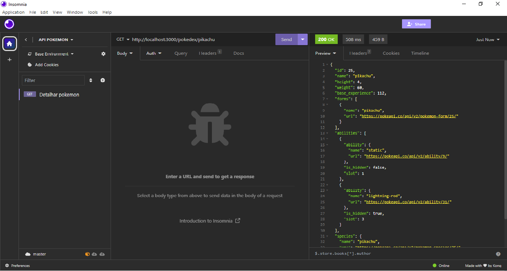

# API - Pokemon

### Essa aplicação serve para mostrar alguns detalhes de um pokémon especifico dado o seu número na pokedéx ou o seu nome.

# Como rodar o projeto
### Para rodar o projeto localmente você precisa:

- Executar no terminal Node.js:
    
    1. Instalar o pacote npm
        
            npm install

    2. Inicializar o servidor

            npm run dev 

- Executar no navegador ou em um programa:

    1. Acessar o link do servidor

            http://localhost:3000/podedex

    2. Informar no link o número ou o nome do pokemon que deseja ver

            http://localhost:3000/pokedex/1
            
            http://localhost:3000/podekex/pikachu

## Tecnologias usadas:

- JavaScript

- Node.js

- Npm

- JSON

